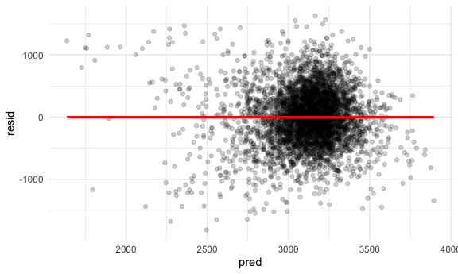
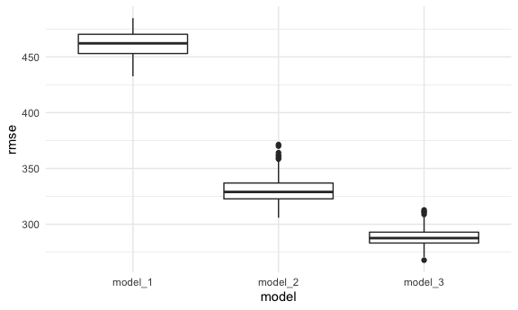
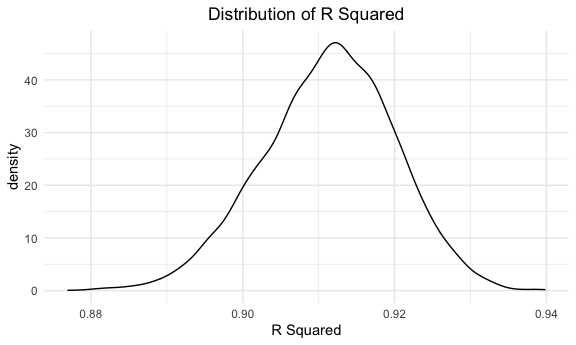

p8105_hw6_az2587
================
Anyu Zhu
11/28/2021

## Problem 1

``` r
birthweight = read_csv("birthweight.csv") %>% 
  janitor::clean_names() %>% 
  mutate(
    babysex = as.factor(babysex),
    frace = as.factor(frace),
    malform = as.factor(malform),
    mrace = as.factor(mrace)
  )
```

    ## Rows: 4342 Columns: 20

    ## ── Column specification ────────────────────────────────────────────────────────
    ## Delimiter: ","
    ## dbl (20): babysex, bhead, blength, bwt, delwt, fincome, frace, gaweeks, malf...

    ## 
    ## ℹ Use `spec()` to retrieve the full column specification for this data.
    ## ℹ Specify the column types or set `show_col_types = FALSE` to quiet this message.

``` r
purrr::map(birthweight, ~sum(is.na(.)))
```

    ## $babysex
    ## [1] 0
    ## 
    ## $bhead
    ## [1] 0
    ## 
    ## $blength
    ## [1] 0
    ## 
    ## $bwt
    ## [1] 0
    ## 
    ## $delwt
    ## [1] 0
    ## 
    ## $fincome
    ## [1] 0
    ## 
    ## $frace
    ## [1] 0
    ## 
    ## $gaweeks
    ## [1] 0
    ## 
    ## $malform
    ## [1] 0
    ## 
    ## $menarche
    ## [1] 0
    ## 
    ## $mheight
    ## [1] 0
    ## 
    ## $momage
    ## [1] 0
    ## 
    ## $mrace
    ## [1] 0
    ## 
    ## $parity
    ## [1] 0
    ## 
    ## $pnumlbw
    ## [1] 0
    ## 
    ## $pnumsga
    ## [1] 0
    ## 
    ## $ppbmi
    ## [1] 0
    ## 
    ## $ppwt
    ## [1] 0
    ## 
    ## $smoken
    ## [1] 0
    ## 
    ## $wtgain
    ## [1] 0

Fan, Cuifang et al. “Paternal factors to the offspring birth weight: the
829 birth cohort study.” International journal of clinical and
experimental medicine vol. 8,7 11370-8. 15 Jul. 2015

Singh, G et al. “Maternal Factors for Low Birth Weight Babies.” Medical
journal, Armed Forces India vol. 65,1 (2009): 10-2.
<doi:10.1016/S0377-1237(09)80045-2>

``` r
model_1 = lm(bwt ~ fincome + gaweeks + ppbmi + pnumlbw + pnumsga, data = birthweight)

birthweight %>% 
  add_predictions(model_1) %>% 
  add_residuals(model_1) %>% 
  ggplot(aes(x = pred, y = resid)) +
  geom_point(alpha = 0.2) + 
  geom_smooth(se = F, color = "red", method = "lm")
```

    ## Warning in predict.lm(model, data): prediction from a rank-deficient fit may be
    ## misleading

    ## Warning in predict.lm(model, data): prediction from a rank-deficient fit may be
    ## misleading

    ## `geom_smooth()` using formula 'y ~ x'



``` r
model_2 = lm(bwt ~ blength + gaweeks, data = birthweight)
model_3 = lm(bwt ~ bhead + blength + babysex + 
               bhead * blength + bhead * babysex + blength * babysex + 
               bhead * blength * babysex, data = birthweight)
```

cv to compare

``` r
cv_df = crossv_mc(birthweight, 100) %>% 
  mutate(
    model_1 = map(train, ~lm(bwt ~ fincome + gaweeks + ppbmi + pnumlbw + pnumsga, data = .x)),
    model_2 = map(train, ~lm(bwt ~ blength + gaweeks, data = .x)),
    model_3 = map(train, ~lm(bwt ~ bhead + blength + babysex + 
               bhead * blength + bhead * babysex + blength * babysex + 
               bhead * blength * babysex, data = .x))
  ) %>% 
  mutate(
    rmse_model_1 = map2_dbl(model_1, test, ~rmse(model = .x, data = .y)),
    rmse_model_2 = map2_dbl(model_2, test, ~rmse(model = .x, data = .y)),
    rmse_model_3 = map2_dbl(model_3, test, ~rmse(model = .x, data = .y)))

cv_df %>% 
  select(starts_with("rmse")) %>% 
  pivot_longer(
    everything(),
    names_to = "model", 
    values_to = "rmse",
    names_prefix = "rmse_") %>% 
  mutate(model = fct_inorder(model)) %>% 
  ggplot(aes(x = model, y = rmse)) + geom_boxplot()
```



## Problem 2

``` r
weather_df = 
  rnoaa::meteo_pull_monitors(
    c("USW00094728"),
    var = c("PRCP", "TMIN", "TMAX"), 
    date_min = "2017-01-01",
    date_max = "2017-12-31") %>%
  mutate(
    name = recode(id, USW00094728 = "CentralPark_NY"),
    tmin = tmin / 10,
    tmax = tmax / 10) %>%
  select(name, id, everything())
```

    ## Registered S3 method overwritten by 'hoardr':
    ##   method           from
    ##   print.cache_info httr

    ## using cached file: ~/Library/Caches/R/noaa_ghcnd/USW00094728.dly

    ## date created (size, mb): 2021-10-05 10:29:26 (7.602)

    ## file min/max dates: 1869-01-01 / 2021-10-31

``` r
set.seed(1234)

boot_sample = function(df) {
  sample_frac(df, size = 1, replace = TRUE)
}

boot_strap_df = 
  tibble(
    strap_number = 1:5000,
    strap_sample = rerun(5000, boot_sample(weather_df))
  )

boot_strap_results = 
  boot_strap_df %>% 
  mutate(
    models = map(.x = strap_sample, ~lm(tmax ~ tmin, data = .x)),
    results = map(models, broom::glance)
  ) %>% 
  select(strap_number, results) %>% 
  unnest(results)
```

R^2

``` r
boot_strap_results %>%
  ggplot(aes(x = adj.r.squared)) +
  geom_density() +
  labs(
        title = "Distribution of R Squared",
        x = "R Squared"
    ) +
  theme(plot.title = element_text(hjust = 0.5))
```


CI:

``` r
boot_strap_results_2 = 
  boot_strap_df %>% 
  mutate(
    models = map(.x = strap_sample, ~lm(tmax ~ tmin, data = .x)),
    results = map(models, broom::tidy)
  ) %>% 
  select(strap_number, results) %>% 
  unnest(results) %>% 
  select(term, estimate) %>% 
  pivot_wider(names_from = term, values_from = estimate) %>% 
  unnest(cols = c(`(Intercept)`, tmin)) %>% 
  rename(B_0 = "(Intercept)",
         B_1 = tmin) %>% 
  mutate(log = B_0 * B_1)

boot_strap_results_2 %>% 
  ggplot(aes(x = log)) +
  geom_density()
```


